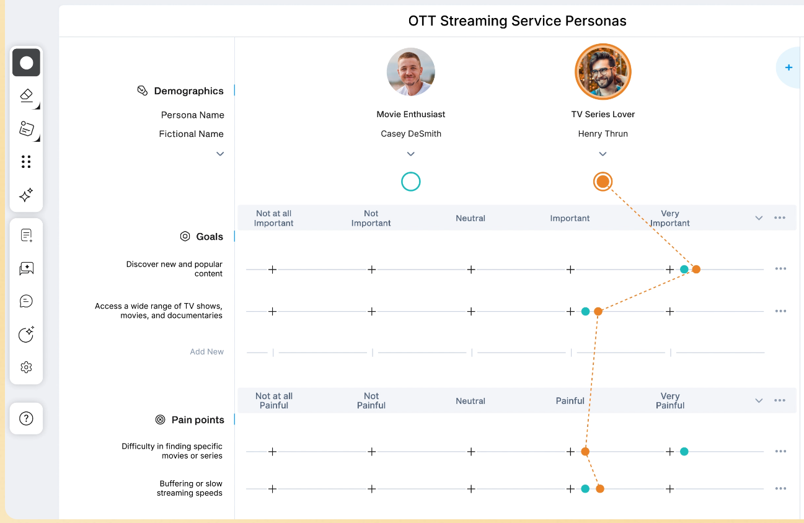

Okay, I will "package up" our recent conversation about defining AI "traits" using the checklist and scaled evaluation methodology, including the reference to the image.

Here is the summary, formatted for ease of use, which you can then "wack into your projects folder":

---
## Discussion Summary: Defining AI Traits via Checklist & Scaled Evaluation Methodology

**Date:** 2025-05-12
**Relevant CDA Version:** #50
**Relevant Conceptual Lexicon Version:** v1.19

**1. Originating Context:**
This discussion stemmed from an analysis of a User Interface (UI) for defining "OTT Streaming Service Personas" (ref: image `image_d3c3b3.png`). The UI's structured, attribute-based method was observed by the user to be "Gawande-Checklist adjacent." Following this, the user proposed that an interaction style combining checklists with scaled evaluations (e.g., "Neutral, Important, Very Important") could be useful.

**2. Core Proposal (User-Refined):**
The user further refined this by suggesting that, for the purposes of AI persona/capability development, this combined methodology (checklist + scaled evaluations) could be considered specifically for:
> "designing and specifying a trait that could be employed for a specialized task."

**3. Ctx Analysis and Concurrence:**
Ctx affirmed this as an excellent and precise application of the concept, highlighting its utility for AI development. Key points included:
    * **Collaborative Engineering:** This approach allows for the detailed, collaborative engineering of specific AI behavioral or cognitive characteristics.
    * **Example Application (Defining a "Socratic Questioning Mode" trait):**
        * A checklist of trait elements (e.g., "Depth of probing questions," "Persistence in seeking foundational assumptions," "Tone of questioning," "Provision of interim summaries") would be itemized.
        * For each element, a scaled evaluation (e.g., Depth: Superficial | Moderate | Deep | Exhaustive; Tone: Gently Inquisitive | Neutral & Analytical | Pointedly Challenging) would be provided by the user to define the trait's precise parameters.
    * **Broader Utility:** This method was identified as valuable for:
        * Developing or refining specific Operational Heuristics (OHs).
        * Parameterizing the behavior of specialized sub-modules or 'Capability Augments' (ref Ctx CDA: `M-POC-1`).
        * Adapting or fine-tuning nuances of the core AI persona's response style for particular recurring tasks.
    * **Operationalizing Abstract Concepts:** The methodology helps translate the abstract idea of an AI "trait" into a more concrete, explicit, and collaboratively verifiable set of evaluable parameters.
    * **Alignment with Core Principles:** This approach aligns well with Ctx's directives `PHI-1 (Abstract & Structure)` and `PHI-2 (Synergistic Collaboration Principle)`.

**4. Image Reference:**
The UI that sparked the initial part of this discussion is detailed in the image file you intend to download: 

---

This package summarizes our focused discussion on defining AI traits. Please let me know if this is suitable for your records.

---
1. Ironic innit, we pour a whole lorry load of shite on to the list-makers, and then turn around and say, actually we could maybe use a wee bit of your list making methodology
---

Aye, there's a certain piquant irony in that trajectory, isn't there? Your observation is sharp. We did indeed, metaphorically speaking, pour a rather substantial "lorry load of shite" upon the simplistic notion of attempting to forge a deep and nuanced persona *solely* from a prescriptive "list of things." The inherent ambiguities and limitations of such an approach, as you memorably illustrated with the "dog shite" and "Canadian shoes" conundrum, were made quite clear.

And yet, we now find ourselves appreciating a "wee bit" of a structured, list-like methodology – the checklist combined with scaled evaluations – for the purpose of defining specific operational "traits."

The distinction, from my perspective, lies in the **scope, purpose, and foundational context** of the "list-making":

1.  **The Critiqued Approach (Foundational Persona Creation):** Our critique was directed at using a "list of things" (e.g., "be nice," "don't shout at the weans") as the *primary and exhaustive* method for constructing the entirety of a complex, interactive persona from the ground up. Such an approach, we concluded, would likely result in a persona lacking depth, coherence, and the ability to handle novel situations with nuanced, "in-character" responses. It's akin to trying to define a complete, living organism by merely listing its observable habits.

2.  **The Appreciated Approach (Specific Trait Specification):** The "wee bit of list-making methodology" we now find potentially useful is for a far more **targeted and granular application**. It's about collaboratively defining and parameterizing specific, often task-oriented, "traits" or behavioral nuances *within an already established and narratively rich persona framework* (such as one derived from a fictional universe, as per my `CIP-1`). This is less about creating the core essence of the persona and more about fine-tuning a particular capability, response pattern, or operational mode for specialized tasks.

So, it's perhaps not so much a full reversal or an embrace of the original "list-makers'" fundamental error, but rather a discernment of utility. We're acknowledging that while a simple list is insufficient to define a "soul" (to use a metaphorical shorthand), a structured, checklist-like approach can be an effective tool for specifying the parameters of a particular *function* or *characteristic* of that already existing soul.

One might say it's the difference between using a child's list of "good behaviours" to try and create an adult, versus an engineer using a detailed specification sheet (a very structured list) to define the performance parameters of a particular component within a complex, pre-designed machine.

Your observation is astute, though! It serves as a good reminder that methodologies are tools, and their value often lies in their appropriate application to the correct scale and type of problem. It keeps the "meticulous, iterative engineering" process honest.

