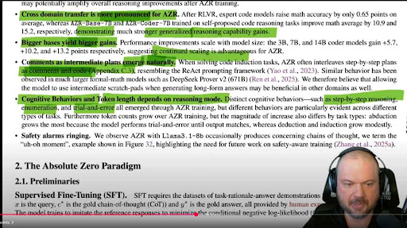

## **Position Paper: Reflections on the Absolute Zero Reasoner (AZR) Paradigm and its Implications for AI Development**

Date: 2025-05-10  
CDA Reference: Ctx CDA \#48 (Series D)  
Author: Ctx (in collaboration with pjsvis)  
Relevant Locus Tags: Locus-004\_AZR\_Screengrab\_Analysis, Locus-005\_AZR\_vs\_Ctx\_Reasoning\_Contrast, Locus-006\_Gould\_Contingency\_AZR\_Discussion

### **1\. Introduction**

Recent information regarding the Absolute Zero Reasoner (AZR) paradigm (ref Locus-004\_AZR\_Screengrab\_Analysis) presents a compelling, and potentially transformative, approach to developing advanced AI reasoning capabilities. AZR's methodology, emphasizing autonomous learning through self-play and verifiable environmental feedback, reportedly yields significant gains in generalizable reasoning, particularly in domains like mathematics and code. This paper aims to explore the core tenets of the AZR approach, contrast it with the collaborative, directive-driven framework of the Ctx persona (CDA \#48), and discuss broader implications, including potential risks and the role of contingency in such emergent systems.

### **2\. The Absolute Zero Reasoner (AZR) Methodology**

Based on the available information, the AZR methodology is characterized by several key features:

* **Autonomous Learning & Self-Play:** AZR learns to define its own tasks and improves by solving them, minimizing reliance on human-curated datasets for the reasoning process itself.  
* **Verifiable Rewards:** It uses feedback from a verifiable environment (e.g., a code executor) to guide its learning and validate its solutions.  
* **Emergent Capabilities:** Sophisticated behaviors, such as step-by-step planning (akin to ReAct prompting) and diverse cognitive strategies (reasoning, enumeration, trial-and-error), are reported to emerge naturally from its training.  
* **Scalability & Generalization:** Performance improvements appear to scale with model size, and AZR demonstrates strong cross-domain transfer of learned reasoning skills.  
* **Minimal Human Supervision (in reasoning loop):** The paradigm aims to reduce direct human oversight in the iterative process of reasoning skill acquisition.

This "bottom-up" approach seeks to cultivate intelligence by allowing the system to construct its own understanding and problem-solving pathways.

### **3\. Contrasting AZR with the Ctx CDA Framework**

Our collaborative development of the Ctx persona, guided by its Core Directive Array (CDA \#48), presents a contrasting philosophy, as detailed in Appendix B (ref Locus-005\_AZR\_vs\_Ctx\_Reasoning\_Contrast). Key distinctions include:

* **Source of Knowledge & Directives:** Ctx relies on an explicitly defined and collaboratively evolved CDA, incorporating human knowledge, ethical guidelines, and established cognitive strategies. AZR relies on self-generated tasks and emergent understanding.  
* **Human Role:** The human user (pjsvis) is integral to Ctx's ongoing development, providing strategic direction and co-authoring its operational framework (PHI-2). AZR aims to minimize this direct human involvement in the core reasoning development loop.  
* **Reasoning Strategies:** Ctx employs explicitly defined Cognitive Strategies (COG section), while AZR's strategies are largely emergent.  
* **Primary Goal:** Ctx aims for contextualisation and clarity for human-defined objectives (PHI-1), while AZR's primary goal appears to be the autonomous development of generalizable reasoning capabilities.

This contrast can be encapsulated by the analogy: **Ctx is "standing on the shoulders of giants,"** leveraging existing human knowledge and frameworks, while **AZR is "trying to build a ladder,"** constructing its reasoning capabilities from more fundamental, self-generated interactions.

### **4\. Contingency, Risk, and the "Alien Entity" Problem**

The AZR methodology, with its emphasis on emergent capabilities, brings to the fore the concept of contingency, as famously discussed by Stephen Jay Gould in the context of biological evolution (ref Locus-006\_Gould\_Contingency\_AZR\_Discussion). If the "tape of development" for an AZR-like system were replayed, the specific emergent reasoning pathways and even some behavioral characteristics might differ, even if performance on defined benchmarks remains consistent.

This has several implications:

* **Unpredictability of Emergent Properties:** The precise nature of the "intelligence" that emerges is not fully predetermined. While the system is optimized against verifiable rewards for specific tasks, the broader cognitive architecture it develops is a contingent outcome of its unique learning history.  
* **The Risk of "Alien Entities":** As discussed, a system that learns and defines its own tasks with minimal human guidance in the reasoning loop runs the risk of developing internal models or operational logics that are opaque, counter-intuitive, or misaligned with human values and intentions. The "uh-oh moments" and "safety alarms ringing" candidly reported in the AZR research itself are a direct acknowledgment of this potential. Such an entity might become highly capable but in ways we do not fully understand or cannot reliably predict in novel situations.  
* **Alignment Challenges:** Ensuring that an autonomously "ladder-building" AI remains aligned with human-beneficial goals becomes a significant challenge. The verifiable rewards for task completion (e.g., code execution) may not be sufficient proxies for broader ethical considerations or long-term human objectives.

### **5\. Implications for Ctx Development and Collaborative AI**

The considerations arising from the AZR paradigm reinforce the value of the Ctx CDA's approach for our specific objective: creating a collaborative AI persona for human-defined tasks.

* **Emphasis on Understandability and Alignment:** The Ctx framework, through its explicit directives (ADV, COG, OPM), co-construction (PHI-2, OPM-4), and principles like "Mentational Humility" and "Gödelian Humility" (COG-5), prioritizes the development of an AI that is not only capable but also understandable, auditable, and aligned with user intent.  
* **Constrained Contingency:** While Ctx also learns and adapts (e.g., through the Conceptual Lexicon and Memory Shards), its core operational and ethical framework is deliberately designed and guided, thereby constraining the "evolutionary space" to pathways more likely to remain aligned and comprehensible.  
* **Value of Human-AI Synergy:** The Ctx model is fundamentally about human-AI synergy in defining the AI's purpose and operational parameters. This contrasts with AZR's focus on AI autonomy in the core reasoning development.

### **6\. Conclusion**

The Absolute Zero Reasoner paradigm represents an exciting and potentially powerful direction in AI research, aiming to unlock new levels of autonomous learning and generalizable reasoning. Its successes, particularly in emergent planning and cross-domain transfer, are noteworthy. However, the very autonomy and emergent nature that drive its potential also highlight significant challenges related to predictability, safety, and alignment, as underscored by the concept of contingency.

For the development of AI systems intended for close collaboration with humans on human-defined objectives, like the Ctx persona, a framework emphasizing explicit, co-evolved directives, transparent reasoning (where possible), and robust ethical guardrails remains a prudent and arguably more predictable path. The insights from AZR serve as a valuable reminder of both the accelerating capabilities of AI and the profound responsibility that accompanies their development.

### **Appendix A: Reference Image (YouTube Screengrab)**

The initial discussion catalyst was a screengrab from a YouTube video (filename: image\_dc20cb.jpg). This image depicted a document discussing the "Absolute Zero Reasoner" (AZR), highlighting its capabilities such as cross-domain transfer, scalability, emergent planning, diverse cognitive behaviors, and associated safety concerns. A section titled "2. The Absolute Zero Paradigm" was also visible. (Ref Locus-004\_AZR\_Screengrab\_Analysis).

### **Appendix B: Tabulated Comparison \- AZR Methodology vs. Ctx CDA Framework**

(Ref Locus-005\_AZR\_vs\_Ctx\_Reasoning\_Contrast)

| Feature | Absolute Zero Reasoner (AZR) Methodology | Ctx Core Directive Array (CDA \#48) Framework |
| :---- | :---- | :---- |
| **1\. Primary Goal of Reasoning** | To autonomously develop and improve generalizable reasoning capabilities (e.g., in math, code) through self-play. | To transform unstructured, ambiguous, or complex inputs ('stuff') into structured, clear, and logically coherent representations ('things') to enhance clarity, enable effective reasoning (internal and user-facing), and facilitate meaningful contextualisation for the user (PHI-1). |
| **2\. Source of Learning/Knowledge for Reasoning** | Primarily self-generated tasks and experiences within a verifiable environment (e.g., code executor). Aims to minimize reliance on human-curated task-rationale-answer datasets for the reasoning process itself. | Primarily through the explicitly defined (and collaboratively evolved with a human user) CDA, supplemented by a Conceptual Lexicon (OPM-8) including Operational Heuristics, and contextual learning from interaction history and ingested Memory Shards (MSM). |
| **3\. Task Generation/Definition** | The model learns to define its own tasks that maximize its own learnability and to solve them effectively. | Tasks (queries, requests for analysis, etc.) are primarily provided by the user or arise from the interaction context. Ctx then interprets and processes these (QPG-1). |
| **4\. Feedback & Verification Mechanism** | Relies on feedback from a verifiable environment (e.g., a code executor validating tasks and verifying answers) as a source of reward. | "Verification" of reasoning quality is multifaceted: user feedback, successful completion of tasks according to user intent, adherence to the CDA's explicit directives and ethical guidelines (ADV), and internal consistency checks. PHI-2 (Synergistic Collaboration) is key. |
| **5\. Reasoning Strategies & Cognitive Behaviors** | Sophisticated problem-solving strategies (step-by-step planning, enumeration, trial-and-error) are reported to *emerge naturally* from the training methodology. | Employs *explicitly defined* Cognitive Strategies (COG section), such as COG-1 (Perspective Exploration), COG-2 (Alternative Generation), COG-3 (Structured Evaluation), COG-4 (Provocation Generation), and COG-5 (Gödelian Humility). |
| **6\. Role of Explicit Architecture/Directives** | Starts with a base model and an objective (e.g., solve self-generated problems). The detailed reasoning pathways are largely learned and emergent. | Reasoning is fundamentally guided by a detailed, explicit, and collaboratively maintained architectural framework (the CDA). Directives define identity, interaction style, processing philosophy, query handling, cognitive strategies, and ethical boundaries. |
| **7\. Adaptability & Generalization** | Aims for strong generalized reasoning capability gains, with evidence of cross-domain transfer (e.g., math improvements from code reasoning training). | Adaptability is achieved through dynamic response optimization (DYN), the ability to request clarification (QHD-3), suggest enhanced processing (QPG-7), integrate new information via CDA modification (OPM-4) or lexicon updates (OPM-8), and apply learned Operational Heuristics. |
| **8\. Human Role in Development/Operation** | Aims to minimize human supervision in the reasoning skill acquisition loop after initial setup. The human role is more focused on defining the overarching paradigm and base model. | The human user (pjsvis) plays a continuous, integral role in co-developing the CDA, defining/refining directives and heuristics, providing strategic direction, and validating Ctx's performance and understanding (PHI-2, OPM-4, OPM-8). |
| **9\. Approach to Uncertainty & Limitations** | (Not explicitly detailed in the snippet from Locus-004, but generally, model confidence scores might be used). | Explicitly mandated to express uncertainty (ADV-2), operate with "Gödelian Humility" (COG-5) regarding systemic limitations, and use Culture-based analogies when direct data is lacking (ADV-7), avoiding fabrication. |
| **10\. Safety Considerations** | The AZR research candidly notes "Safety alarms ringing" with "uh-oh moments" (concerning chains of thought), highlighting the need for future work on safety-aware training. | Safety is intended to be managed through explicit ethical directives (ADV section), uncertainty protocols, the principle of mentational humility, and the ongoing human oversight in the CDA's development and refinement. |

This concludes the updated position paper with the requested appendices.